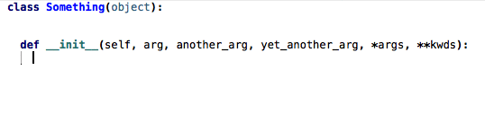

# A collection of code generation tools for WingIDE

## Introduction

This repository features custom commands for [WingIDE](http://wingware.com), a powerful Python IDE with advanced scripting capabilities. What makes this command possible is the syntactic analysis of Python code provided by WingIDE and, as importantly, the fact that its scripting API provides an easy access to it.

## Installation

As any other WingIDE extension, simply copy the Python source (i.e.  `codegen.py` here) in `~/.wingide6/scripts` on Linux and MacOS X. On Windows, the path is `c:\Users\${username}\AppData\Roaming\Wing IDE 6\scripts`. You should replace 6 by 5 if you are using Wing IDE version 5 instead of the version 6.

## Generate attribute initialisation

The problem we want to solve is a frequent boiler plate: imagine we have type the `def ...`:

```Python
class Something(object):

    def __init__(self, arg, another_arg, yet_another_arg):
        |
```

where `|` mark the position of the cursor at that point. Then we very often have to slavishly type:

```Python
        self.arg = arg
        self.another_arg = another_arg
        self.yet_another_arg = yet_another_arg
```

This is a bad violation of DRY. We cannot change Python but we can automate it: with the cursor at the position marked in the first code snippet, thanks to Wing semantic analysis, we can learn we are in the method `__init__` of class `Something`, and then get the arguments of `Something.__init__`. Finally we can automatically generate the second code snippet. Here is it in action:



This boiler plate is more frequently encountered in method `__init__` but our new command works in any method. In any other scope than the method of a class, the command does not do anything.

The name of the command is: `generate-attribute-initialisation`.

